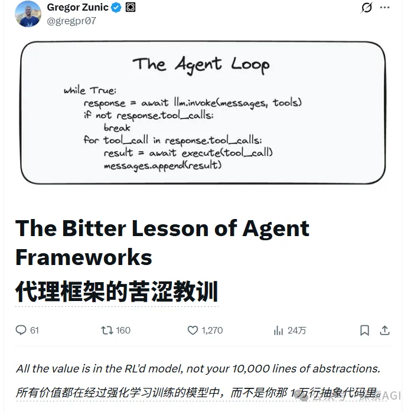
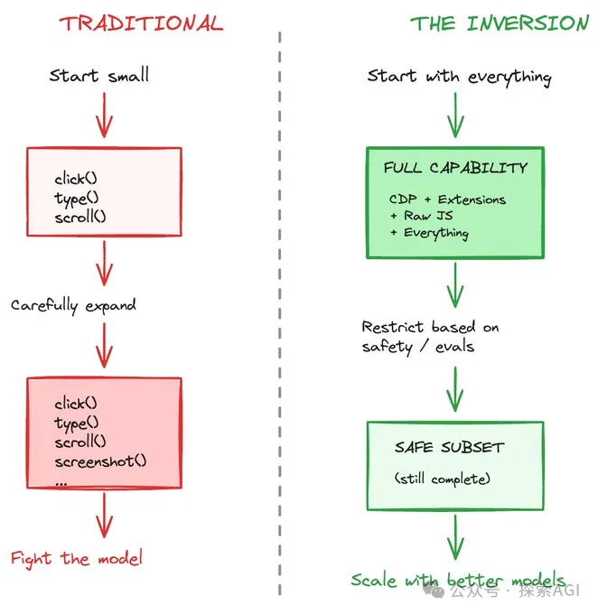
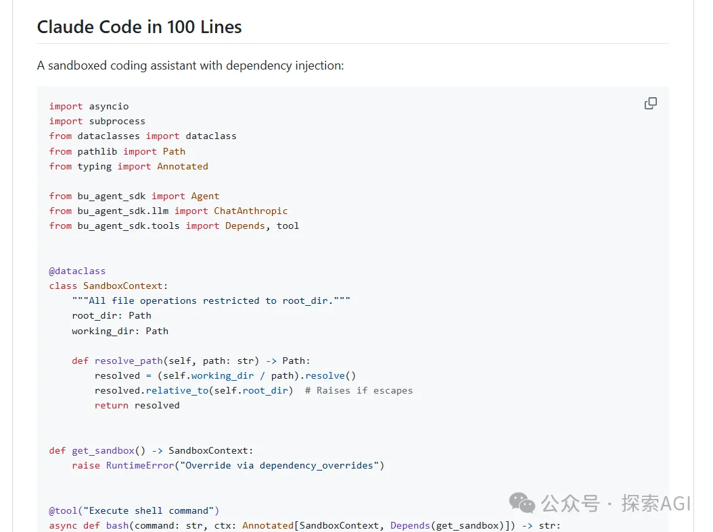

# 你那上万行 Agent 代码都是垃圾！Browser Use 作者骑脸输出，开源了 Manus 级内核

> 来源：微信公众号 探索AGI，2026-01-20
> 原文链接：https://mp.weixin.qq.com/s/QeQcZqm6P-8uCcZ87g8ESw

## 核心观点

**Browser Use 作者 Gregor Zunic 开源了驱动 BU.app 的 Agent 内核。核心设计理念简单到极致：一个 for 循环 + 3 大支柱。作者直言："所有的价值都在 RL 过的模型里，不在你那上万行的垃圾抽象代码里。"**

---


## 背景

Browser Use 表示最近要发布他们的 Manus：BU.app，但他们提前把驱动 BU 的 Agent 内核开源了。

它的核心设计理念，简单到近乎是一种嘲讽。

作者 Gregor Zunic 直接在 X 上骑脸输出：



在这个框架里，没有什么复杂的规划层、记忆层、工具层、反思层...

它只有一个 for 循环。

是的，没错。

现在最顶级的 AI Agent，本质上就是：一个不断让 AI 说话、干活、再说话的死循环。

---

## 一、The Bitter Lesson

在机器学习里有个概念，中文叫**苦涩的教训**：凡是试图用人类知识去硬编码规则的方法，最终都会被更大的算力 + 更强的通用模型打得满地找牙。

现在我们很容易犯这个错误，通过预设 workflow，让 AI 先第一步，再第二步的干活。

BU.app 第一版也这么干的，写几千行来管理 AI，结果变成了：

> "Every experiment fought the framework."（每一个实验都在和框架打架。）

模型不蠢，是我们蠢。现在的模型，想操作 Spotify，根本不需要你写一个 Spotify 工具，它直接写一段脚本就搞定了。

所以，Browser Use 做了一个违背祖宗的决定：**扔掉所有中间商，把 99% 的工作放在模型上。**


---

## 二、3 大支柱

当然，如果只是一个 while 循环，那谁都会写。

但是要把这个循环跑通，跑到 SOTA，还需要这 3 大核心补丁。

### 逆向思维

传统的 Agent 设计思路是：我要让 AI 能点击，我就给它写个 Click 函数；我要让它输入，我就写一个 Type 函数。



逆向思维是，反过来，**直接把 Chrome DevTools Protocol (CDP) 的底层权限给 AI。**

让 AI 拥有上帝视角，如果 A 路不通，它自己会找 B 路。这才是真正的智能，而不是我们预设好的程序。

### 上下文管理

为了专门解决浏览器太重的问题，他们设计了第二个补丁。

一个网页的 DOM 结构，如果直接塞给 AI，那肯定不行，这玩意随便一动就是 50KB。

如果是个死循环，跑个 10 轮，AI 瞬间就嗝屁了。

他们做了一个很简单的机制：

只保留最近 3 次的网页记忆，之前的信息，全部物理去掉。

AI 不需要记得 10 分钟前网页长什么样，它只需要知道现在长什么样。

当然达到一定的阈值，如 80%，自动总结上下文也是必不可少的。

```python
@tool("Get browser state", ephemeral=3)  # 只保留最近3条
async def get_state() -> str:
    return massive_dom_and_screenshot
```

### 强制结束

过去我们用的框架，都是，没有工具调用就算结束了，让 AI 输出结果。

他们发现，这样可能会有很多遗漏，所以，增加一个 done 工具，强制要求 AI 显式完成。

```python
@tool("Signal completion")
async def done(message: str) -> str:
    raise TaskComplete(message)

agent = Agent(
    llm=llm,
    tools=[..., done],
    require_done_tool=True,  # 自主模式
)
```

---

## 三、实际能用吗？

用起来非常方便，很简单就能支持 OpenRouter 的模型，而且是 FastAPI 的风格。



README 上有一个很有意思的样例，100 行代码就可以实现类似 Claude Code 的编程助手。

而且这 100 行的实现，工具上，包含了 bash、文件读写、搜索、todo、done。还有完整的编程环境，文件操作都做了越界访问限制。

---

## 四、写在最后

**大道至简，返璞归真。**

这个项目给了我们设计 AI 应用开发的本质。当模型足够强大时，最有效的框架反而是最简单的那个。

有人评论说：

> "我喜欢，2026 年 1 月的 Agent 框架 = 2022 年 12 月的 Agent 框架。时间是个循环。"

**The bitter lesson: The less you build, the more it works.**

---

**项目地址**：https://github.com/browser-use/agent-sdk
