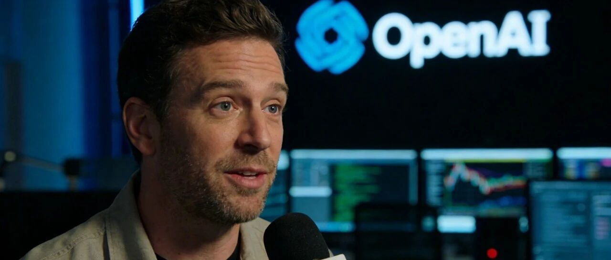
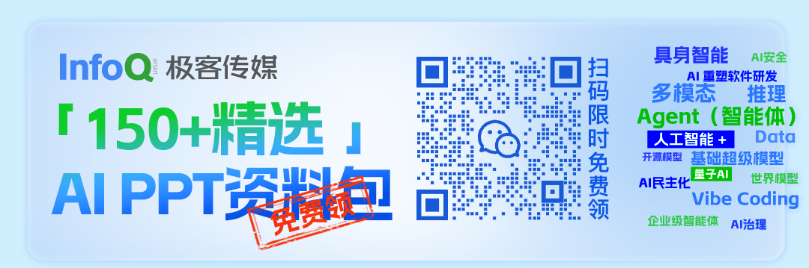
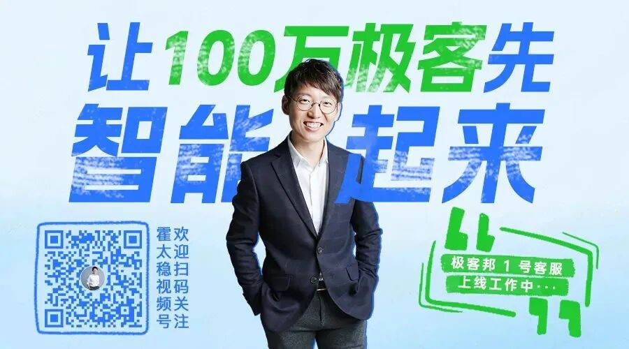

# OpenAI 七年老将离职：大模型同质化竞赛下的行业反思

> 来源：InfoQ 公众号，编译 | Tina，2026-01-23
> 原文链接：https://mp.weixin.qq.com/s/81OnMVR5svDURu_2mHUypQ

## 核心观点

**OpenAI 前核心研究员 Jerry Tworek 离职访谈揭示了当前大模型行业的深层问题：所有主要 AI 公司都在开发几乎相同的技术，产品几乎没有区别，这迫使研究者追求短期利益而非实验性突破。**

---

## 背景介绍

这不是离职八卦，而是在一个把技术做成剧情、把研究变成围观的行业里，扛了七年高压后的选择。

2026 年的第一个月，Jerry Tworek 离开 OpenAI 的消息传出时，几位 OpenAI 员工在 X 上几乎失控地发声："我真的崩溃了""这太难受了"。

Jerry 是现代 AI 浪潮背后最有影响力、却也最少公开露面的关键人物之一：
- 2019 年加入 OpenAI（当时仅约 30 名员工）
- 参与了 Q-Star 和 Strawberry 推理方法（发展为 o1 推理模型）
- 离职原因：想从事有风险的基础研究，但在 OpenAI 已不可能

---

## 主要观点

### 1. 行业同质化严重

"让我感到非常'难过'的事，就是现在几乎所有 AI 实验室都在试图做和 OpenAI 一模一样的事情。"

**现状分析**：
- 大约有五家体量巨大的 AI 公司使用完全同一套"配方"
- 99.9% 的用户根本察觉不出这些模型有什么不同
- 所有实验室都挤在一个非常接近的位置上

**问题**：
- 真正的探索在哪里？
- 真正的创新空间在哪里？
- 真正能让你和别人拉开距离的差异化又在哪里？

### 2. 研究与商业化的脱节

Jerry 对 ChatGPT 广告的看法体现了这一脱节：

> "这是一种商业策略，而我负责训练模型。"

**创新不足的原因**：
1. **风险偏好降低**：用户增长指标、GPU 成本成为约束
2. **组织架构僵化**：org chart 决定了哪些研究是可能的
3. **跨团队研究困难**：团队各自为政，职责分明

### 3. OpenAI 的失误 vs Google 的回归

"我个人其实不太愿意把这件事称为'Google 的回归'。它应该被视为 **OpenAI 的失误**。"

**关键观点**：
- OpenAI 在某些阶段出现过判断或执行上的失误
- 领先优势如果执行得足够好，是可以持续保持的
- Google 做出了许多正确的决策，并追了上来

**关于员工流失**：
- 人来人往本身很正常
- 但如果是因为"方向不对、决策错了"才走，说明公司确实有问题
- 有些事情推进得比它本可以达到的节奏要慢

### 4. Anthropic 的"清晰感"

"在过去一年里，我对 Anthropic 的印象提升得非常明显。"

**认可点**：
- 代码模型、编码 Agent 上的成果
- 围绕"开发者"建立的整体产品和品牌
- 拥有一大群真正满意的开发者用户

**成就**：
- 起步更晚、算力更少、团队更小
- 依然高度聚焦，执行得非常好
- 正在实质性地提升企业生产力

---

## 研究方向思考

### 下一个突破口

"我不觉得 Transformer 会是机器学习的最终架构。"

**被低估的方向**：

1. **架构创新**
   - 对 Transformer 架构过于"路径依赖"
   - 一定存在训练大模型的其他方法

2. **持续学习（Continual Learning）**
   - 如何把测试时与训练时真正打通
   - 人类没有"专门学习模式"和"专门回答问题模式"
   - 这可能是 AGI 之前最后几个关键能力之一

3. **世界模型 + 强化学习**
   - Yann LeCun 的方向"无疑是正确的"
   - 强化学习教会模型"技能"
   - 但模型必须先理解世界

### AGI 时间线

"也许会早一点，也许会晚一点：可能是 2026，也可能 2027、2028、2029。"

**必要步骤**：
- 持续学习完全还没有以真正的方式被整合
- 多模态感知（理解视频）
- 真正通用的强化学习

---

## 行业娱乐化反思

### "肥皂剧"式叙事

"技术、概念、人类情绪、现实生活，是分不开的。"

**现状**：
- 谁离职、谁跳槽、谁被挖、谁"内部有分歧"
- 每天都像连续剧更新
- 湾区像一个巨大的转会市场

**问题**：
- 当一个行业被持续围观，每一次进展都会被强行赋予意义
- 你不是在安静地做研究，而是在聚光灯下跑一场没有终点的马拉松

### 压力与韧性

"这就像做俯卧撑。每经历一次艰难、紧张的时刻，你就更擅长应对压力一点。"

**七年高压的影响**：
- 学会了屏蔽噪音
- 学会在混乱中保持稳定
- 把异常当成常态，把围观当成空气

**有人评价**："在 OpenAI 工作，比自己创业还更有压力。"

---

## 对研究者的建议

### 探索 vs 利用

"我们是否太过于'利用'已被证明有效的路径，而太少'探索'全新方向？"

**问题**：
- 你愿意花多少精力去探索"其他可能性"？
- 又有多少精力继续沿着你已经走得很顺的那条路往前推？

### 风险与信念

"我肯定愿意投入很多时间。但与此同时，我也非常坚定地认为：**研究应该尽可能快地推进。**"

**关键要素**：
- **聚焦（Focus）**：算力被分散到太多项目上，效果会被稀释
- **信念（Conviction）**：如果你只做一个项目，它往往会推进得更快

**代价**：
- 如果它失败了，你会非常惨
- 但如果它成功了，你可能会拥有世界上最好的模型

### 从 0 到 1 vs 从 1 到 100

"我自己、以及我在 OpenAI 共事过的团队，真正特别擅长的一件事，是'从 1 到 100'。"

**能力**：
- 拿已有初步证据的新想法
- 想办法把它们在大规模上做得可靠、稳定、可落地
- 好的方法和节奏，几个月就能完成

---

## 总结与启示

### OpenAI 的成功与局限

**成功之处**：
- 把"可用的智能"分发给了非常多的人
- 在很多关键问题上做对了选择
- 证明了扩展机器学习模型规模的价值

**局限**：
- 研究路线与产品开发之间的分歧
- 组织架构对创新方向的限制
- 商业化压力对风险偏好的影响

### 行业需要什么？

"也许这确实是对的选择，但我还是希望能看到更多多样性——更多模型层面的差异。"

**理想状态**：
- 很多不同的公司，在做很多不同的事情
- 研究者能投入到自己最相信的研究方向中
- 历史会证明哪一条路是对的

### 给开发者和研究者的启示

1. **不要只盯着渐进式改进**：去思考有没有办法把整个棋盘掀翻
2. **聚焦和信念比算力更重要**：算力往往够用的，关键是聚焦
3. **少跑实验，多想深一点**：花时间分析数据反而更容易带来突破
4. **研究结构与远比"明星"更重要**：好的结构、文化、协作方式才是研究引擎

---

## 对话金句

> "如果你想做一些偏离主流机器学习路线的事情，真的非常难找到一个合适的地方。"

> "这世上大概已经有五家相当严肃、体量巨大的 AI 公司，基本上在用完全同一套'配方'，试图在同一套技术之上，做出一点点差异化的产品。"

> "当一个行业被持续围观，你不是在安静地做研究，而是在聚光灯下跑一场没有终点的马拉松。"

> "把整个公司押注在一个全新的、完全不同的方向上，同时不在乎下个季度 Gemini 会不会更强——这真的非常难。"

> "在 OpenAI，每一年都像是在一家完全不同的公司里。"

---

*图片来源：InfoQ 公众号原文*
*播客来源：Core Memory，YouTube 链接：https://www.youtube.com/watch?v=VaCq4u5c78U*

