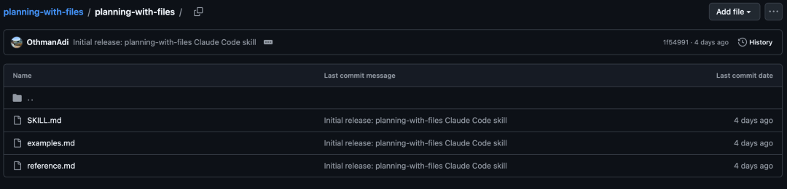

# 拆解一个 3k Star 的 Skills：它到底写了什么？顺便还能学习 Manus 的上下文管理


> 来源：知乎专栏 CYCHENYUE，2026-01-08
> 原文链接：https://zhuanlan.zhihu.com/p/1992416332776498488

## 核心观点

**这个 Claude Code 技能（planning-with-files）上线不到一周已经 3000+ star，它复刻了 Manus 的核心工作方法——文件系统作为外部记忆、通过复述操控注意力、保留失败记录。文章拆解了技能的 9 个设计技巧。**

---

## 背景

一个 **Claude Code** 技能，上线不到一周，已经 3000+ star。

它复刻的是 **Manus** 的核心工作方法。

Manus 公开了自己的方法论，OthmanAdi 把它写成了一个可以直接用的技能。

今天拆解这个技能具体写了什么，它是怎么把 Manus 的思路落地的，以及我们能学到什么。

---

## 文件结构



整个技能就 4 个文件：

```
planning-with-files/
├── SKILL.md        ← 主文件，AI 会读这个
├── reference.md    ← 原理解释，按需加载
├── examples.md     ← 使用案例，按需加载
└── README.md       ← 给人看的说明
```

核心就是 SKILL.md，其他都是补充。

这个结构本身就值得学：主文件不要太长，详细内容拆出去。这叫**渐进式披露**——不要一次性把所有信息塞给 AI，按需加载。

---

## 技巧一：description 要塞满触发词

### description 怎么写的

翻译过来是：

**描述**：将工作流转换为使用 Manus 风格的持久化 Markdown 文件，用于规划、进度追踪和知识存储。当开始**复杂任务**、**多步骤项目**、**研究任务**时使用，或者当用户提到**规划**、**组织工作**、**追踪进度**、需要**结构化输出**时使用。

它塞了 **7 个触发场景**：

1. 复杂任务
2. 多步骤项目
3. 研究任务
4. 规划
5. 组织工作
6. 追踪进度
7. 结构化输出

### 为什么要这么多？

因为 Claude 判断"要不要用这个技能"，主要看 description 和用户说的话有没有匹配。

模糊的 description 激活率只有 20%，具体的能到 80%+。

---

## 技巧二：把重要信息存到文件里，不要全塞进上下文

### 3 文件模式：为什么是 3 个？

技能的核心是 3 文件模式：

- **task_plan.md** → 追踪目标和进度
- **notes.md** → 存储研究和发现
- **[交付物].md** → 最终输出

### 为什么要用文件？

这就要说到 Manus 的第一个核心原理：**文件系统作为外部记忆**。

AI 的上下文有三个问题：

1. **会爆**——塞太多就超限了
2. **会忘**——上下文太长，中间的内容会被忽略
3. **会漂**——调用 50 次工具后，原始目标可能早忘了

文件没有这些问题。写进文件的东西不会丢，需要的时候随时读取。

所以这个技能的设计思路是：把 AI 的"脑子"外挂到文件系统上。

---

## 技巧三：重要目标要反复读取，不要只说一次

### 快速开始：4 步循环

技能的快速开始写了 4 步：

1. 在工作目录创建 task_plan.md 文件
2. 用 checkbox 定义各个阶段
3. 每完成一个阶段就更新——打勾并更新状态
4. **做决策前先读一遍**——刷新注意力窗口里的目标

### 注意第 4 步

这对应 Manus 的第二个核心原理：**通过复述操控注意力（Attention through Recitation）**。

大模型有个毛病叫"**中间遗忘**"——上下文太长后，开头和中间的内容权重会下降，只有结尾的内容权重最高。

### 怎么解决？

每次做重要决策前，让 AI 重新读一遍 task_plan.md。

**读一遍 = 把目标重新放到上下文的结尾 = 刷新注意力。**

---

## 技巧四：错误要记录下来，不要假装没发生

### 模板设计：错误记录

技能提供了完整的 task_plan.md 模板：

```markdown
任务计划：[简要描述]

## 目标
[用一句话描述最终要达成的状态]

## 阶段
• 阶段 1：规划和准备
• 阶段 2：研究/收集信息
• 阶段 3：执行/构建
• 阶段 4：检查和交付

## 关键问题
1. [需要回答的问题]
2. [需要回答的问题]

## 已做决策
• [决策]：[原因]

## 遇到的错误
• [错误]：[解决方案]

## 当前状态
目前在阶段 X - [我正在做什么]
```

### 注意"遇到的错误"这一栏

这对应 Manus 的第三个核心原理：**保留失败记录**。

本能反应是：出错了，悄悄重试，别让人看到。

Manus 说：错。

> *"Erasing failure removes evidence. And without evidence, the model can't adapt."*
>
> 删掉失败记录，就删掉了证据。没有证据，模型无法学习。

正确做法：把每次失败都写进文件。当 AI 看到之前的错误记录，它会自动调整策略，避免重复犯错。

---

## 技巧五：写反模式，正反对照，让 AI 更容易理解边界

### 反模式表格：正反对照

技能里有一个设计很聪明——反模式表格：

| ❌ 错误做法 | ✅ 正确做法 |
|-----------|-----------|
| 用 TodoWrite 做持久化 | 创建 task_plan.md 文件 |
| 目标说一次就忘 | 每次决策前重读计划 |
| 隐藏错误悄悄重试 | 把错误记录到文件里 |
| 把所有东西塞进上下文 | 大段内容存到文件里 |
| 上来就开始干活 | 先创建计划文件 |

这 5 条反模式，其实就是 Manus 原理的反面：

- **第 1 条**：文件系统 > 内置工具（TodoWrite 重启就没了）
- **第 2 条**：反复复述 > 说一次就忘
- **第 3 条**：保留错误 > 隐藏错误
- **第 4 条**：外部存储 > 上下文塞满
- **第 5 条**：先规划 > 直接开干

不只告诉你"要做什么"，还告诉你"不要做什么"。

---

## 技巧六：规则要短、要强调、要有"不可商量"的语气

技能列了 5 条关键规则：

1. 永远先创建计划
2. 决策前先读计划
3. 行动后立刻更新
4. 存文件，不塞上下文
5. 记录所有错误

每条规则都是**动词 + 对象**的结构，简洁有力。

它还用了"永远""绝不"这种强调词：

> **绝不在没有 task_plan.md 的情况下开始复杂任务。**
>
> 这一条不可商量。

---

## 技巧七：主文件只写操作，原理拆到单独文件

### reference.md：原理放这里

主文件只讲"怎么做"，不讲"为什么"。

想了解原理，去看 reference.md：

- 注意力操控技术
- 错误恢复模式
- Manus 的上下文优化

不是所有人都想知道原理，想看的人自己去看。这样主文件保持简洁，不会吓跑只想快速上手的人。

---

## 技巧八：提供完整案例，降低使用门槛

### examples.md：案例放这里

同样的思路，案例也单独放。

想看案例，去看 examples.md：

- 研究任务示例
- Bug 修复示例
- 功能开发示例
- 错误恢复示例

每个例子都是完整流程：从创建计划到最终交付。

这就是"抄作业"的地方——照着改就能用。

---

## 技巧九：结构要从"能用"到"用好"递进

### 整体结构：从能用到用好

回头看整个 SKILL.md 的结构：

1. 快速开始（4 步，立刻能用）
2. 3 文件模式（核心方法）
3. 工作循环（具体流程）
4. 模板（直接抄）
5. 规则（必须遵守）
6. 使用场景（什么时候用）
7. 反模式（什么不要做）
8. 进阶指引（想深入去看别的文件）

这个顺序是有讲究的：**先让你会用 → 再告诉你细节 → 最后给边界和进阶**。

从上到下，信息密度递减。急着用的人看前两段就够了，想深入的人可以继续往下看。

---

## 总结：9 条可以学习的技巧

1. **description 塞满触发词**，提高激活率
2. **重要信息存文件**，不要全塞上下文（Manus：文件系统作为外部记忆）
3. **重要目标反复读取**，不要只说一次（Manus：通过复述操控注意力）
4. **错误要记录**，不要假装没发生（Manus：保留失败记录）
5. **写反模式**，正反对照
6. **规则要短、要强调、不可商量**
7. **主文件只写操作**，原理拆出去
8. **提供完整案例**，降低使用门槛
9. **结构从"能用"到"用好"递进**

前 4 条是 Manus 方法论的落地，后 5 条是技能写法的技巧。

---

## 用户反馈

这个项目上线不到一周就 3000+ star，说明真的有人在用。

用户反馈最多的几个点：

1. "终于不用每次手动提醒 Claude 记住目标了"
2. "错误记录功能救了我，不会反复踩同一个坑"
3. "可以随时打开 task_plan.md 看 AI 在干嘛，透明度很高"

批评的声音：

1. "每个任务 3 个文件，目录会乱"
2. "简单任务用不上，太重了"

社区已经有人做了 **Cursor** 版本，说明这套方法论是跨工具的。

---

## 怎么用

### 方法一：直接安装

git clone 到你的 `~/.claude/skills/` 目录。注意要把子目录里的文件移到上一层。

GitHub：https://github.com/OthmanAdi/planning-with-files

### 方法二：学它的写法

把这 9 条技巧用到你自己的技能里。

### 方法三：学它的方法论

- **复杂任务** → 先写计划
- **决策之前** → 先读计划
- **出错之后** → 记录下来

不一定要用这个技能，手动做也行。

---

## 结语

这个技能火，不是因为它用了什么高深的技术。而是它把 Manus 的方法论，用正确的方式写成了技能：

- **文件系统作为外部记忆** → 落地成 3 文件模式
- **通过复述操控注意力** → 落地成"决策前读计划"
- **保留失败记录** → 落地成"错误记录"栏

方法论不复杂，复杂的是怎么写成一个好用的技能。这个项目做到了。
