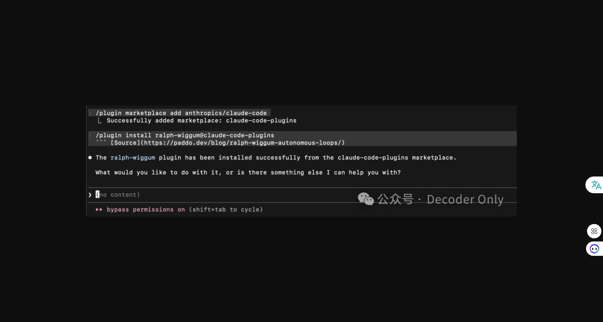

# 卷死你的 Claude Code，让它彻夜干活：ralph loop 插件一手体验

> 来源：微信公众号 Decoder Only（湾仔码农），2026年1月15日
> 原文链接：https://mp.weixin.qq.com/s?src=11&timestamp=1768930464&ver=6492&signature=...

---

## 核心观点

Ralph Loop 插件让 Claude Code 能够"天真执着"地持续执行长任务，适合有详细 PRD 和测试用例但执行耗时的场景。配合浏览器自动化测试效果最佳，可不知疲倦地循环执行直到达成目标。

---

## 背景：什么是 Ralph Loop？

最近 Claude Code 之父 Boris 分享了一个数字，过去 1 个月内，提交了 259 个 PR，添加了 40000 行代码。这背后，是 Claude Code 不眠不休地在帮他干活。

你可能好奇，怎么让 Claude 持续不间断运行长任务？这背后的秘密就是 Anthropic 近期开放的一个插件 —— ralph wiggum（最近因为版权原因，改名为 ralph loop 了）。

---

## 一个有意思的小故事

说到 ralph wiggum，这个名字来源于美国动画片《辛普森一家》，他最大的特点就是智力迟钝但"天真执着"，认定目标后，即使犯错也会不断尝试。

去年，有个澳洲的码农（真·码农，之前一直写代码，最近在澳洲养山羊）Geoffrey Huntley 在他的一篇博客里，最早提出了这个理念。他编写了一个只有 5 行的 Bash 脚本，背后的原理很简单——如果需求没做完，就继续循环做，别扯什么"人在回路（Human in the loop）"。

这个理念，近期很快被 Claude Code 和 Amp 所效仿，各自发展出一套类似的能力。

---

## 你什么时候需要用

你用 cc 或其他 AI 编程工具时，是不是经常一个任务开始跑后，就得时不时去检查下，再给它一些反馈。

我最常用的就是 pua 一下"跑完全部单元测试和自动化测试，中间不可以停止"。但这种方式时灵时不灵，最头疼的就是 AI 说"已经完美通过了所有测试"，但你一体验，还是各种 bug。

ralph loop 最厉害的地方，就像动画片的主人公一样，会"天真执着"地帮你执行需求，如果没达到终止条件，它可以一直干下去，直到地老天荒，或者把你的套餐的钱全部花光。

> 穷人玩法：可以先订阅个国内的 GLM 或 K2 模型（质谱官网或火山都行，选个便宜的月费促销，不到一杯奶茶钱），就可以充分暴力地调戏它了。

---

## 怎么用

### 安装

打开 Claude Code，输入以下指令：

```bash
# 添加官方市场
/plugin marketplace add anthropics/claude-code

# 安装插件
/plugin install ralph-loop@claude-plugins-official
```

注意要用 ralph-loop，而不是 ralph-wiggum 了，最早装了这个后面导致还得重来一下。


### 小试牛刀

我们找个项目试一下。最近公众号写比较多，每次粘贴到编辑器都想问候一下他们的产品经理。于是我就想，能否做个小工具，帮我做一键排版？市场上有不少 markdown 的工具，但我都习惯用飞书文档，所以就定个需求，支持从飞书文档复制粘贴，并且多个模板可以选择吧。

不过这个需求还是有些复杂，我们先让 AI 帮我们写个 PRD 吧。打开 raycast，把需求丢进去，我们就得到了一个 PRD 初稿，然后复制粘贴到项目目录，命名为 prd.md。

这里之所以写个 PRD，主要是想测试 ralph 在复杂任务下的表现。你可以采用类似的方法，把你某个想做的 idea 也转成 PRD。

接下来就是重头戏了，直接让它执行看看，先给我弄个 MVP 出来：

```
/ralph-loop:ralph-loop "读取 prd.md，选择 2-3 个最核心的功能实现一个可运行的 MVP。要求：1) 有基本的用户界面 2) 核心功能可以操作 3) 包含基础测试 4) 确保代码可以运行。完成后输出 <promise>MVP_COMPLETE</promise>" --max-iterations 20 --completion-promise "MVP_COMPLETE"
```

这里设定了 20 轮的循环，它开始干活了。按理来说，这时候可以睡觉去了，不过因为是第一次用，还是耐心看下有没有磨洋工。



自己发现了一些语法错误，开始在修复。整体还是按 Claude Code 的任务驱动在往前跑。成功了，开始自己测试，进入循环模式。

但不知道为啥 stop hook 一直报错，结果真的跑了 20 个循环，花了 9 分钟 31 秒。

启动下服务器，看看效果。默认做了 3 个模板，图片粘贴过来也都正常渲染了。我最看重的标题格式，也都有了。分级标题格式、代码块，也都映射好了。

另外，居然都给我做了首行缩进，真是个好学生啊。不过这种排版早就不流行了。

---

## 迭代一下

我们试试看让它多弄几个模板，弄好看点。这次试试看提个模糊的需求，看它完成咋样。把指令也修改下，前面多给了 2 个 promise 标签，这次干掉：

```
/ralph-loop:ralph-loop "读取 prd.md，多提供几个模板（先来10 个吧），找一下微信上比较流行的，大家喜欢的模板，各种颜色的组合。一定要好看，代码块的样式整专业点，mac terminal 有颜色的风格吧，自动换行。然后所有模板，都不要首行缩进了。其他怎么好看，你自己想办法。一定要做到乔布斯复活都来夸你这个设计得有品味。要求：1) 实现以上需求 2) 核心功能可以操作 3) 包含基础测试 4) 确保代码可以运行。完成后输出 <promise>TEMPLATE_ENRICH_COMPLETE</promise>" --max-iterations 20 --completion-promise "TEMPLATE_ENRICH_COMPLETE"
```

这次更快，5 分多钟就搞完了，模板也都有了，看来难度不够啊。我们试试看效果，不错，确实搞了 10 个模板出来，这个绿色的还挺好看的，完美兼容。

---

## 提高难度

前面给的需求还是比较具体的，下面是从一个小哥那学来的技巧，需求描述也贼朴实无华，就是 make it better。我们看看效果，也先来 20 轮：

```
/ralph-loop:ralph-loop "make it better." --max-iterations 20
```

上了个厕所回来，发现搞了 8 个任务，然后开始执行第二次循环了。看着它分解的任务，有点慌，字数统计、移动端响应式、常用模板都整上了，会不会开始屎上雕花了啊。

不管。。。反正是测试，先让它继续跑着，看着就这样，跑了 4 轮，花了 22 分钟。已经有点困了，决定睡觉去，明早再来检验。

早上起来，claude code 比我还早，都自己切到 light mode 了，看了下，跑到第 14 轮就停了，不知道为啥 npm run test 这里卡死了，按理说应该自己能拿到错误自己解决啊。浏览器也有些报错，把错误贴给它看看。

是个转义字符解析的问题，很快就修好了。然后它就继续第 15 个循环了。它干活的同时，来验收下，到底一个晚上都做了啥优化。


看了下，还真是雕花到了极致：暗黑模式、导入 HTML、快捷键、模板预览、模板搜索、常用模板、分类筛选，啥都整上了。不过这些在我看来都不是核心啊，最最重要的还是那个模板要好看。

我们挑几个模板看看是否有进步。哈，有点东西，连字数统计、阅读时间都给我加上了。底部也给我加了些快捷操作按钮。

---

## 小结

测到这里，心里已经大概有了答案。

Ralph loop 最适合的，还是你有了非常详细的 PRD 和测试用例，但人工执行要非常久的场景这个时候，可以让它"笨笨地坚持"、不知疲倦地按照需求干活，不用担心跑偏。然后最好结合浏览器自动化测试，进一步验证效果。这次中间那个错误，就卡在缺了这一步。至于 token，反正你人工执行，也要花那么多，不用太操心。

类似 make it better 的做法，有点偷懒，可能会给你惊喜，但也可能给你写一堆史上雕花的功能，玩玩可以，建议还是慎用。
