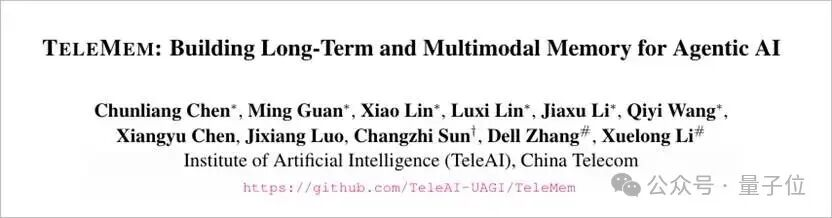
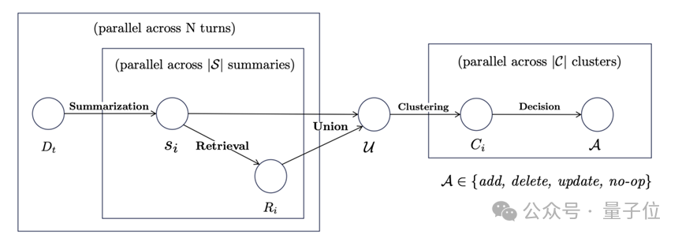
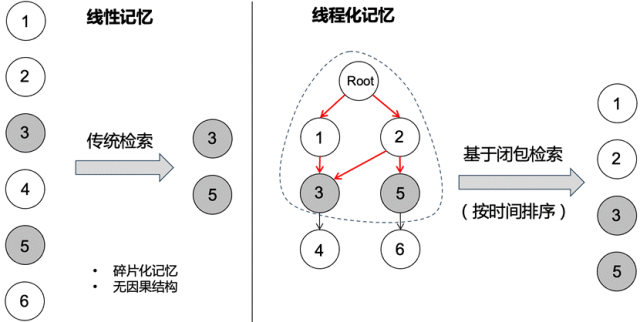
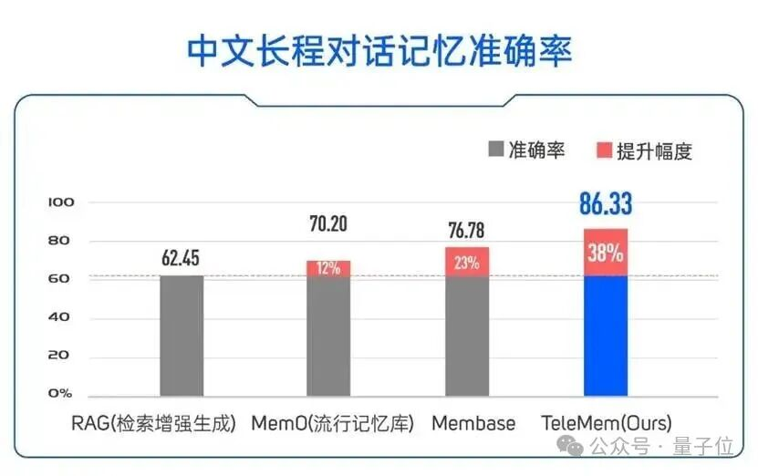

# 让Agent画思维导图稳固长期记忆：新框架实现稳定长期学习，准确率提升38%

> 来源：微信公众号 量子位，2026-01-26
> 原文链接：https://mp.weixin.qq.com/s/_OPVPZ1PU3X4XpLfOfQuoQ

思维导图曾被证明可以帮助学习障碍者快速提升成绩，那么当前已经可堪一用的智能体系统如果引入类似工具是否可以帮助改善长期学习记忆能力呢？

近期，**中国电信人工智能研究院（TeleAI）**研究团队提出了一种基于**DAG（有向无环图）**的通用记忆框架——**TeleMem**，从"数据结构层"重新设计Agent的记忆组织方式，使记忆不仅可检索，而且可持续累积、可回溯、可演化。

在中文长程对话基准 ZH-4O（平均约600轮、多角色场景）测试中，**TeleMem 的准确率达到 86.33%，相比 RAG 基线提升约 38 个百分点**，相比 Mem0 提升约 19 个百分点。

---

## 为什么传统RAG难以支撑长期记忆与持续学习？

当前主流RAG架构通常以向量数据库为核心：

- 每一段记忆被编码为独立向量
- 检索阶段依赖 Top-K 相似度匹配
- 上下文拼接交由大模型自行理解

这种范式在短文本问答场景表现良好，但在长期交互和Agent场景中逐渐暴露出明显问题：

### 1. 缺乏时间与因果结构

向量只能表达语义相似度，无法描述事件先后关系、状态依赖和决策演化路径。这使系统难以形成稳定的学习轨迹，无法区分"新知识是补充、修正还是替代旧认知"。

### 2. 上下文碎片化严重

检索返回的是离散片段，模型需要自行补全逻辑链条，容易产生幻觉与不一致推理。在持续学习场景下，这种碎片化上下文会导致认知漂移和策略不稳定。

### 3. 索引随规模恶化

随着历史数据增长，写入成本、索引漂移和存储冗余不断累积，系统很难在长期运行中保持稳定学习能力。

---

## TeleMem：把"记忆"从向量集合升级为可演化的时序因果图

TeleMem 的核心设计，是将所有历史记忆统一组织为一张"**有向无环图（DAG）**"，把"记忆存储"升级为"可演化的认知结构"。

### 节点

表示一段已经被语义理解并稳定固化的记忆状态，包含内容语义、向量表征和时间信息。每个节点对应一次对话状态、一次关键事件，或一次阶段性的认知更新结果。

### 依赖边

表示节点之间显式的语义与因果依赖关系，即"当前认知由哪些历史状态条件转化而来"。边为有向结构，并严格满足时间约束（只能从更早节点指向更新节点），从而保证语义单调演化，避免循环依赖与认知回滚。

### 路径

多条依赖边串联起来，形成可追溯的记忆演化链，不仅用于描述话题、状态或角色在时间维度上的连续演进，也天然刻画了Agent的认知更新与持续学习轨迹。

### 统一的语义节点：将经验压缩为可复用的学习状态

在 TeleMem 中，节点不再只是一个 embedding，而是承载多类型语义表征的复合结构：

- **用户与角色记忆**：刻画用户画像、长期偏好以及角色状态随时间的演化
- **事件与情境记忆**：对对话片段、视觉内容等交互过程进行语义摘要，形成稳定的事件级学习表示
- **对象与环境状态记忆**：记录物理对象或环境属性的结构化状态变化

---

## 表征与索引的双层协同更新机制

TeleMem 将记忆系统拆分为两个协同演化的层次：

- **表征层**：负责语义内容的抽象、压缩与状态演化
- **索引层**：负责维护节点之间的时间约束、因果依赖与可检索拓扑结构

TeleMem 设计了 **Offline Batch** 与 **Online Stream** 两条更新路径，覆盖不同时间尺度下的更新需求。

### Offline Batch：全量表征整合与离线并行构图

通过高度并行的批处理流水线，将原始交互持续压缩为稳定、可管理的长期语义记忆。主要包括三个步骤：

1. **记忆抽取**：并行抽取标准化记忆表征
2. **检索对齐**：并行匹配新生成表征与已有记忆
3. **聚类决策**：对候选内容进行全局聚类

### Online Stream：增量表征演化与局部索引维护

在线阶段面向实时交互，强调低延迟与持续可用性。在线路径允许短期近似误差，但保证结构持续稳定演化。

---

## 读取阶段：从Top-K拼片段到因果闭包还原

传统RAG的读取方式，本质是"Top-K相似片段拼接"。TeleMem 的读取目标更接近"复原一段完整因果上下文"。

系统会构造一个**最小闭包子图（Minimal Closure Subgraph）**，将回答所需的前置依赖一并补齐：

1. **种子定位**：通过 Top-K 找到最相关节点
2. **因果回溯**：沿依赖边反向遍历，补齐必要祖先
3. **闭包构造**：形成自洽的上下文子图
4. **线性化输出**：按时间顺序组织为模型输入序列

---

## 实验结果与性能表现

在中文长程对话基准 ZH-4O 测试中，TeleMem 的准确率达到 **86.33%**，相比 RAG 基线提升约 **38 个百分点**，相比 Mem0 提升约 19 个百分点。

在保持较高准确率的同时，TeleMem 显著降低了推理成本与延迟，不再需要每次将完整历史上下文输入模型，记忆规模也不再受限于模型的 Context Window，可稳定支持千轮乃至万轮对话。

---

## 趋势观察：Agent记忆正在走向结构化与可演化

TeleMem 的意义不仅是一种工程优化，也反映出一个更长期的技术趋势：

**Agent能力正在从"检索系统设计"逐步转向"记忆结构与持续学习机制设计"。**

当Agent从一次性任务执行者演进为长期运行、持续适应环境的智能体时，记忆不再只是信息缓存层，而成为承载学习、认知演化与策略稳定性的核心基础设施。

未来的智能体需要具备：

- **可追溯的状态与认知演化路径**
- **可持续维护的长期记忆与增量学习能力**
- **可解释的上下文回溯与学习来源追踪能力**

结构化记忆系统不仅是在提升检索效率，而是在为Agent构建一个**可持续学习、可演化认知与长期稳定行为的底层支撑层**。它可能成为下一代Agent基础设施从"工具型系统"迈向"长期智能体"的关键分水岭。

---

## 链接

**GitHub：**
- https://github.com/TeleAI-UAGI/Awesome-Agent-Memory
- https://github.com/TeleAI-UAGI/telemem

**论文链接：**
- https://arxiv.org/pdf/2512.21567
- https://arxiv.org/pdf/2601.06037
